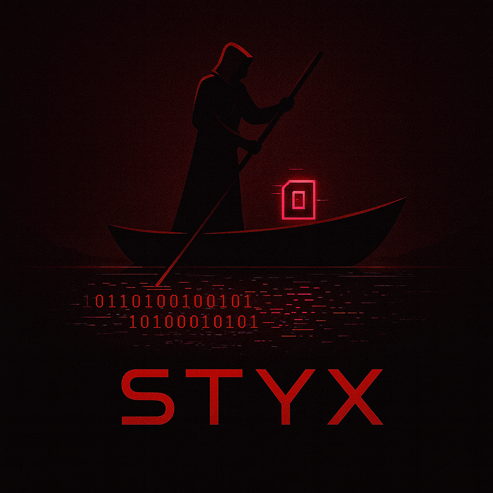

[](https://github.com/SebastianMartinNS/STYX#copyright)
[](https://github.com/SebastianMartinNS/STYX#legal-disclaimer)
[](https://github.com/SebastianMartinNS/STYX/search?l=cpp)
[](https://github.com/SebastianMartinNS/STYX#terms-of-use)

# 🏛️ Styx - Advanced Red Team C2 Framework

> **© 2024 Sebastian Martin. All rights reserved.**
> This software is proprietary and confidential. Unauthorized use, redistribution, or modification is strictly prohibited.

> **⚠️ LEGAL DISCLAIMER: FOR EDUCATIONAL AND AUTHORIZED TESTING PURPOSES ONLY**
> 
> This framework is designed exclusively for:
> - **Authorized penetration testing** with written permission
> - **Security research** and academic study
> - **Defensive security training** and threat simulation
> - **Understanding C2 mechanics** to improve detection capabilities
> 
> **NEVER** deploy on systems without explicit authorization. Users assume full legal responsibility.

## 📖 Overview

**Styx** is an advanced Command & Control (C2) framework designed for red team operations, penetration testing, and security research. It implements modern cryptographic protocols, stealth techniques, and anti-analysis measures to demonstrate real-world attack vectors while maintaining educational value.

```
Client (C++) <-- AES-256-GCM --> Server (Python)
      ↑                             ↑
RSA-OAEP Key Exchange          Session Management
```

## 🚀 Key Features

### 🔒 Advanced Cryptography
- **RSA-2048-OAEP** for secure key exchange
- **AES-256-GCM** for authenticated encryption
- **Perfect Forward Secrecy** with session-based keys
- **Compile-time string obfuscation** to evade static analysis

### 🕵️ Stealth & Anti-Analysis
- **Debugger detection** and evasion techniques
- **VM detection** capabilities (configurable)
- **Process hollowing** resistance mechanisms
- **Timing-based beaconing** with jitter randomization

### 📊 Operational Capabilities
- **Keylogging** with configurable flush intervals
- **Screenshot capture** at specified intervals
- **Remote command execution** with output retrieval
- **Persistent beaconing** with state management
- **Multi-client support** with thread-safe session handling

### 🛡️ Defensive Features
- **SSL/TLS secured communications** (HTTPS)
- **Certificate pinning** via hardcoded public keys
- **Input validation** and bounds checking
- **Secure memory handling** for sensitive data

## 🏗️ Architecture

### Communication Flow


### Component Structure

#### C++ Client (`lab_client_redt_advanced.cpp`)
- **Cryptography**: RSA-OAEP, AES-256-GCM via Windows CNG
- **Stealth**: Anti-debug, anti-VM, string obfuscation
- **Persistence**: Service installation, registry modifications
- **Collection**: Keylogging, screenshot capture, system reconnaissance
- **Communication**: WinHTTP with certificate pinning

#### Python Server (`c2_server_advanced.py`)
- **Cryptography**: RSA key generation, AES-GCM via cryptography.io
- **Session Management**: Thread-safe client state tracking
- **Command Queueing**: Prioritized command execution
- **Logging**: Comprehensive audit trails and operational logging
- **Management**: Interactive operator interface

## 🛠️ Installation & Setup

### Prerequisites

**Server Requirements:**
- Python 3.8+
- OpenSSL for certificate generation
- Required Python packages: `cryptography`, `pyOpenSSL`

**Client Requirements:**
- Visual Studio 2019+ with C++ build tools
- Windows SDK 10.0+
- Windows 7+ target system

### Quick Start

1. **Generate SSL Certificates:**
   ```bash
   openssl req -x509 -newkey rsa:2048 -keyout server.key -out server.crt -days 365 -nodes
   ```

2. **Install Server Dependencies:**
   ```bash
   pip install -r requirements.txt
   ```

3. **Generate RSA Keypair:**
   ```bash
   python c2_server_advanced.py --generate-keys
   ```

4. **Compile Client:**
   ```bash
   cl.exe lab_client_redt_advanced.cpp /EHsc /MT /link advapi32.lib ws2_32.lib winhttp.lib crypt32.lib
   ```

5. **Start Server:**
   ```bash
   python c2_server_advanced.py
   ```

## 📋 Usage

### Server Management Interface

The server provides an interactive management console:

```
=== C2 SERVER MANAGEMENT ===
1. List active clients
2. Send command to client
3. View server logs
4. Exit
```

### Client Deployment

Deploy the compiled client executable in your test environment. The client will:
1. Perform initial RSA key exchange
2. Establish encrypted session
3. Begin periodic beaconing
4. Execute queued commands
5. Return command output securely

### Example Commands

```bash
# System reconnaissance
exec whoami /all
exec systeminfo

# File operations
exec dir C:\\Users\\
exec type C:\\Windows\\System32\\drivers\\etc\\hosts

# Network reconnaissance
exec ipconfig /all
exec netstat -ano

# Process operations
exec tasklist
exec wmic process list brief
```

## 🔒 Security Considerations

### Operational Security
- **Network Isolation**: Deploy only in isolated lab environments
- **Firewall Rules**: Restrict server access to authorized IPs only
- **Key Protection**: Secure `server_private_key.pem` with strict permissions
- **Log Monitoring**: Regularly review server logs for anomalies

### Cryptographic Security
- **Key Rotation**: Regularly regenerate RSA keypairs
- **Perfect Forward Secrecy**: Session keys are ephemeral
- **Authentication**: AES-GCM provides encryption and integrity
- **Certificate Validation**: Client validates server certificate

### Detection Evasion
- **Timing Variations**: Randomize beacon intervals to avoid pattern detection
- **Traffic Obfuscation**: Encrypted payloads resist deep packet inspection
- **Process Behavior**: Mimic legitimate system processes

## 🧪 Testing Environment

### Recommended Lab Setup

```
+-------------------+     +-------------------+     +-------------------+
|   Attacker VM     |     |   C2 Server VM    |     |   Target VM       |
|   (Kali Linux)    |     |   (Ubuntu)        |     |   (Windows 10)    |
|                   |     |                   |     |                   |
| - Testing tools   |<--->| - Styx Server     |<--->| - Styx Client     |
| - Analysis tools  |     | - Port 8443 open  |     | - Beacon to C2    |
+-------------------+     +-------------------+     +-------------------+
```

### Validation Checklist

- [ ] SSL/TLS handshake completes successfully
- [ ] RSA key exchange establishes session key
- [ ] AES-GCM encrypted beacons are transmitted
- [ ] Commands are executed and output returned
- [ ] All communications remain encrypted
- [ ] Logs capture all operational activities

## 📊 Performance Characteristics

### Client Resource Usage
- **Memory**: ~10-20 MB baseline
- **CPU**: <1% during idle, spikes during command execution
- **Network**: ~2-5 KB per beacon, varies with command output
- **Disk**: Minimal writes (logging disabled in production)

### Server Capacity
- **Concurrent Clients**: 50+ with proper hardware
- **Request Handling**: ~100 requests/second
- **Session Memory**: ~1 MB per active client
- **Log Growth**: ~10 MB/day with moderate activity

## 🚨 Legal & Ethical Guidelines

### Authorized Usage
This tool may only be used when ALL of the following conditions are met:

1. **Written Authorization**: Explicit permission from system owner
2. **Legal Compliance**: Adherence to all applicable laws and regulations
3. **Scope Definition**: Clear testing boundaries and objectives
4. **Professional Conduct**: Ethical behavior following industry standards

### Prohibited Activities
- Unauthorized access to computer systems
- Network disruption or denial of service
- Data theft or destruction
- Privacy violations
- Any illegal activities

### Responsibility
Users assume full legal responsibility for their actions. The developers disclaim all liability for misuse.

## 🤝 Contributing

We welcome contributions that enhance the educational value and defensive capabilities of this framework:

### Acceptable Contributions
- **Detection Improvements**: Better AV/EDR evasion techniques
- **Defensive Research**: Analysis of C2 patterns for detection
- **Documentation**: Clear explanations of techniques
- **Testing Tools**: Validation and verification utilities

### Contribution Process
1. Fork the repository
2. Create a feature branch
3. Submit a pull request with detailed description
4. Include testing results and impact analysis

## 📄 License

MIT License with Ethical Use Clause:

```
Permission is granted for educational, research, and authorized testing purposes only.
Commercial use and unauthorized deployment are strictly prohibited.
Users must comply with all applicable laws and regulations.
```

## 🆘 Support

### Issue Reporting
For technical issues or security vulnerabilities:
- Create GitHub issue with detailed description
- Include logs and reproduction steps
- Do not disclose security vulnerabilities publicly

### Educational Resources
- [MITRE ATT&CK Framework](https://attack.mitre.org/)
- [NIST Cybersecurity Framework](https://www.nist.gov/cyberframework)
- [SANS Red Team Operations](https://www.sans.org/cyber-security-courses/)

## 🔮 Roadmap

### Planned Features
- [ ] Cross-platform client support
- [ ] Plugin architecture for extended capabilities
- [ ] Web-based management interface
- [ ] Integrated threat intelligence feeds
- [ ] Automated detection testing framework

### Research Goals
- Improve understanding of C2 detection mechanisms
- Develop better defensive strategies
- Contribute to open-source security tools
- Advance red team training methodologies

---

**Remember**: With great power comes great responsibility. Use this knowledge to protect, not to harm.

*Styx - Crossing the river of knowledge to better defend the digital realm.*