# 🏗️ STYX Architecture Documentation

> **© 2024 Sebastian Martin. All rights reserved.**
> This documentation is proprietary and confidential. Unauthorized use, redistribution, or modification is strictly prohibited.

## 📋 System Architecture

## 📋 System Architecture

### High-Level Overview

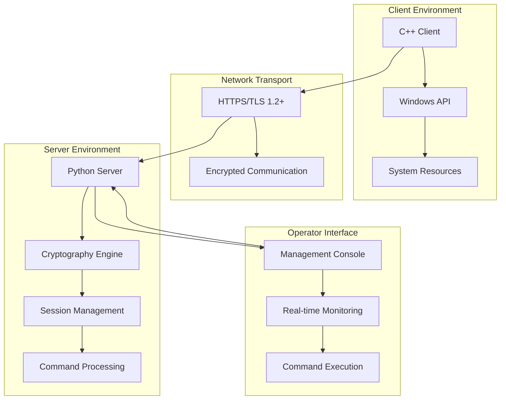

## 🔄 Communication Flow

### Initial Key Exchange Sequence

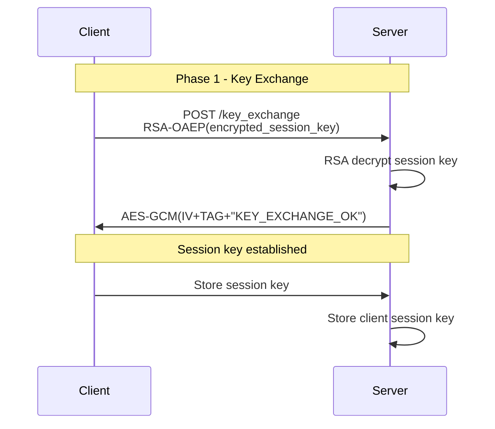

### Beaconing and Command Execution

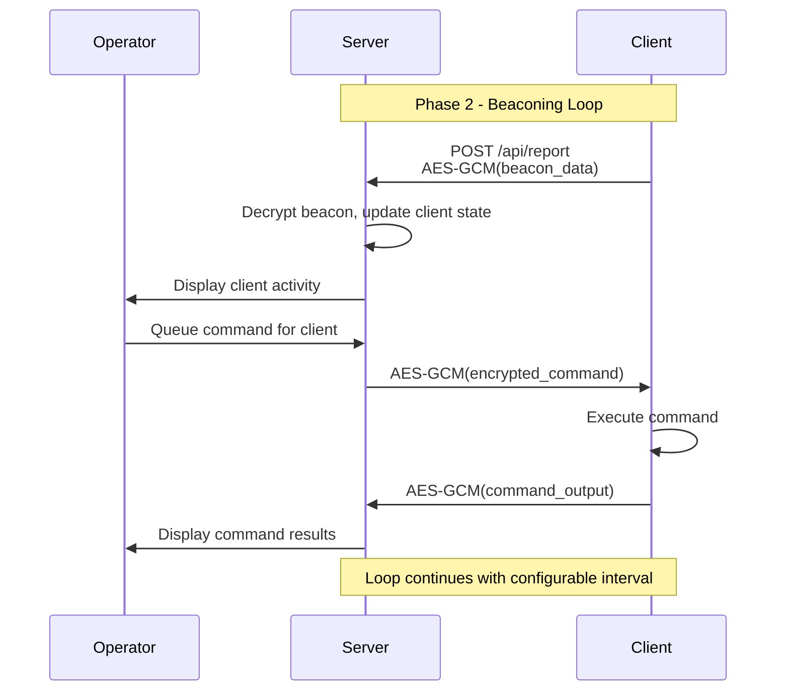

## 🏛️ Component Architecture

### C++ Client Architecture

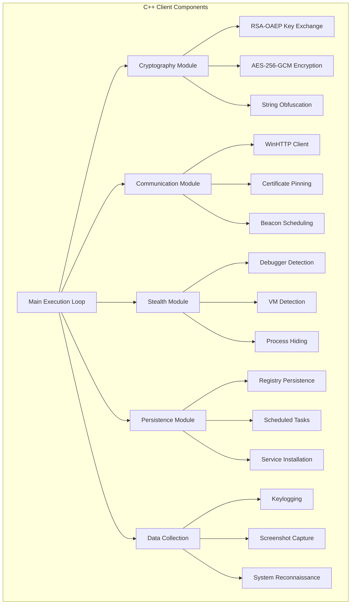

### Python Server Architecture

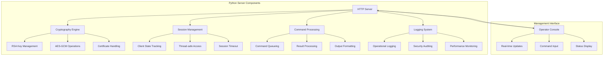

## 🔐 Cryptographic Architecture

### Encryption Flow

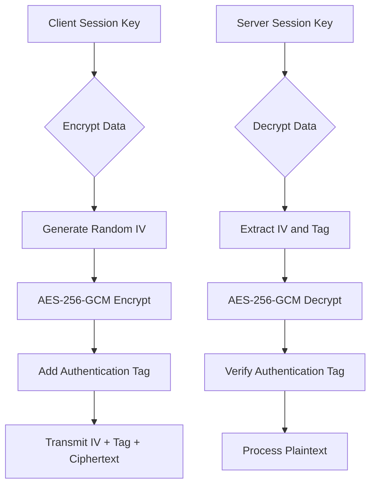

### Key Exchange Protocol

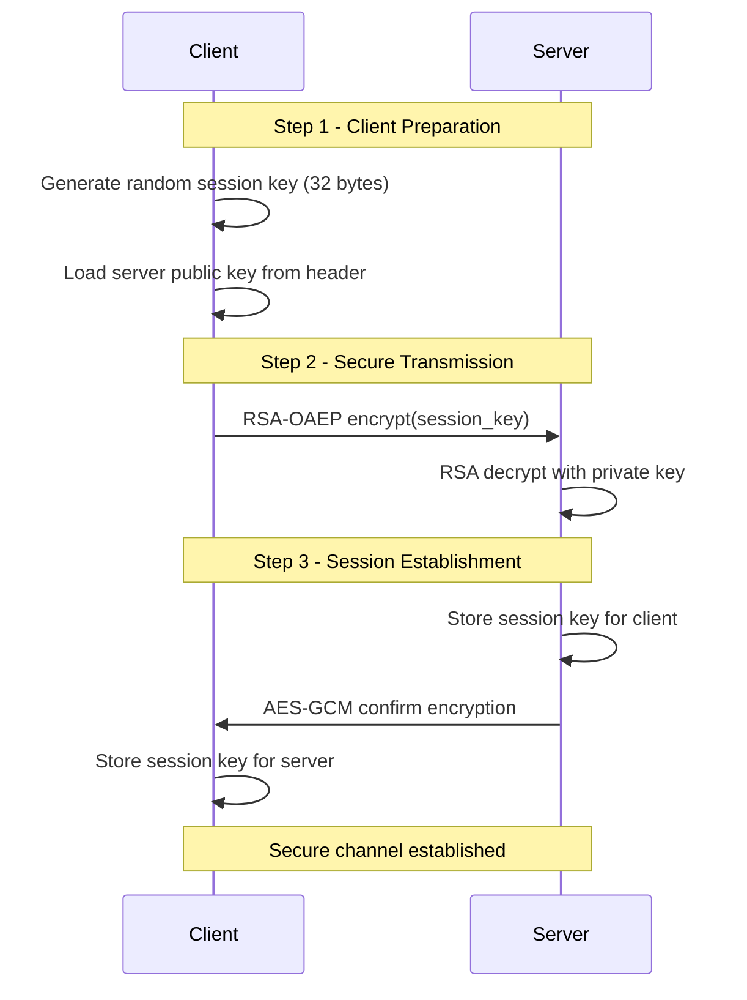

## 📊 Data Flow Architecture

### Beacon Data Structure

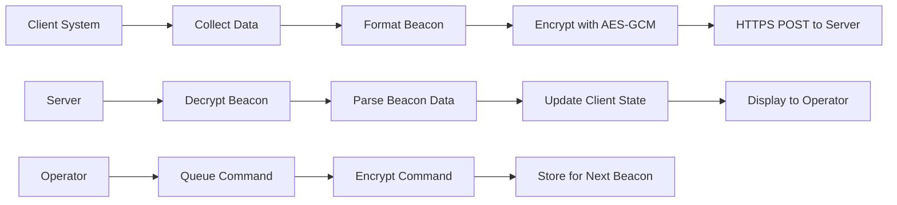

### Beacon Format
```
BEACON|username|hostname|process_id|additional_data
```

## 🎯 Operational Architecture

### Client Deployment Flow

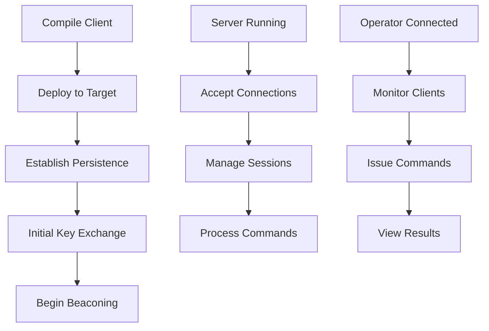

### Command Execution Flow

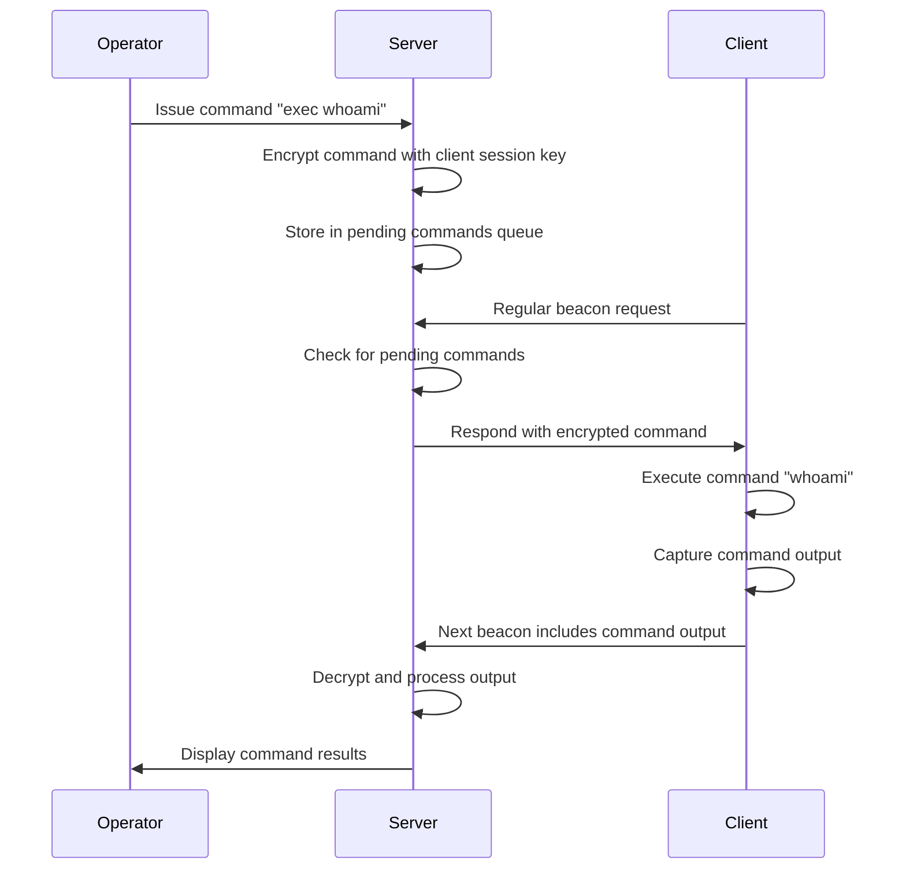

## 🛡️ Security Architecture

### Defense-in-Depth Approach

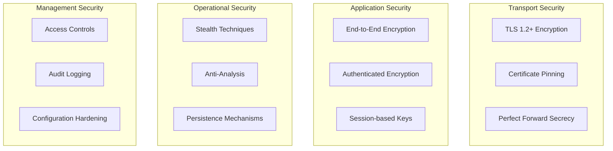

### Threat Mitigation

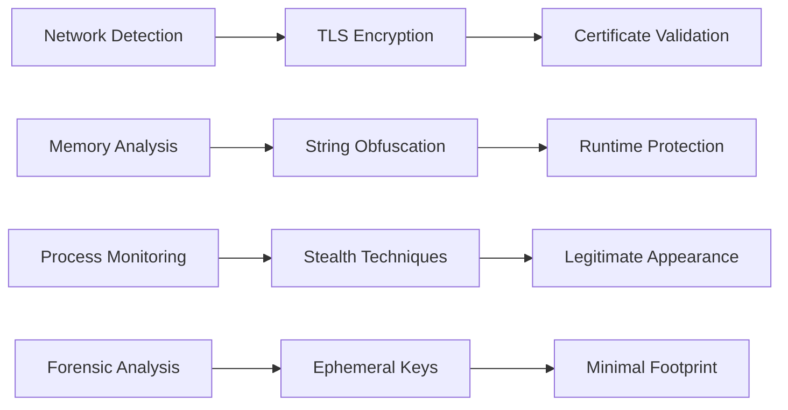

## 📈 Performance Architecture

### Scalability Design

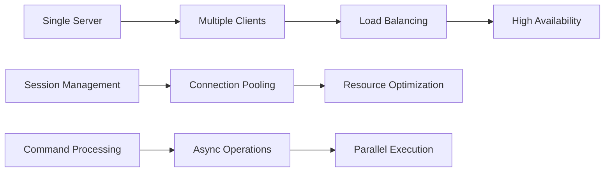

### Resource Management

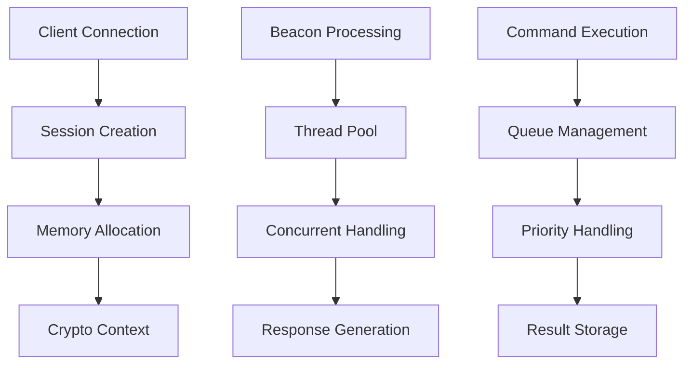

## 🔄 Lifecycle Management

### Client Lifecycle

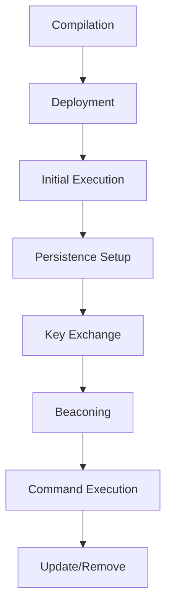

### Server Lifecycle

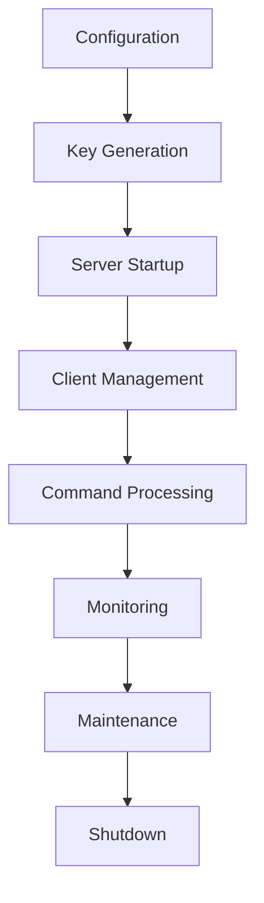

## 🧩 Integration Architecture

### External Integration Points

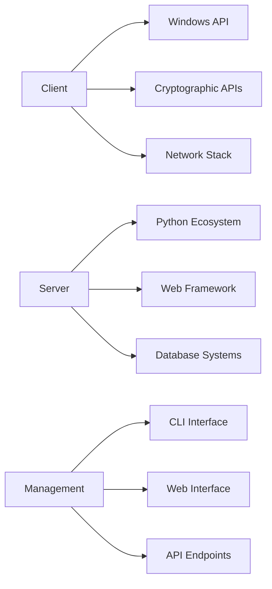

### Extension Points

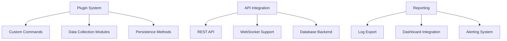

---

*This architecture represents a sophisticated C2 framework designed for authorized security testing. All components implement defense-in-depth security principles and follow industry best practices.*