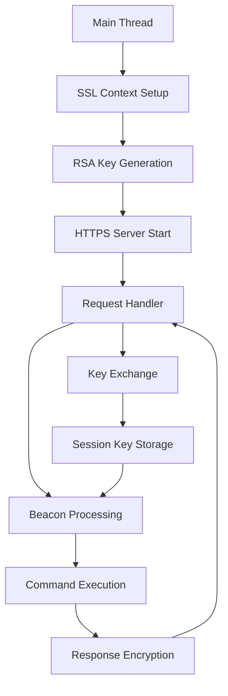
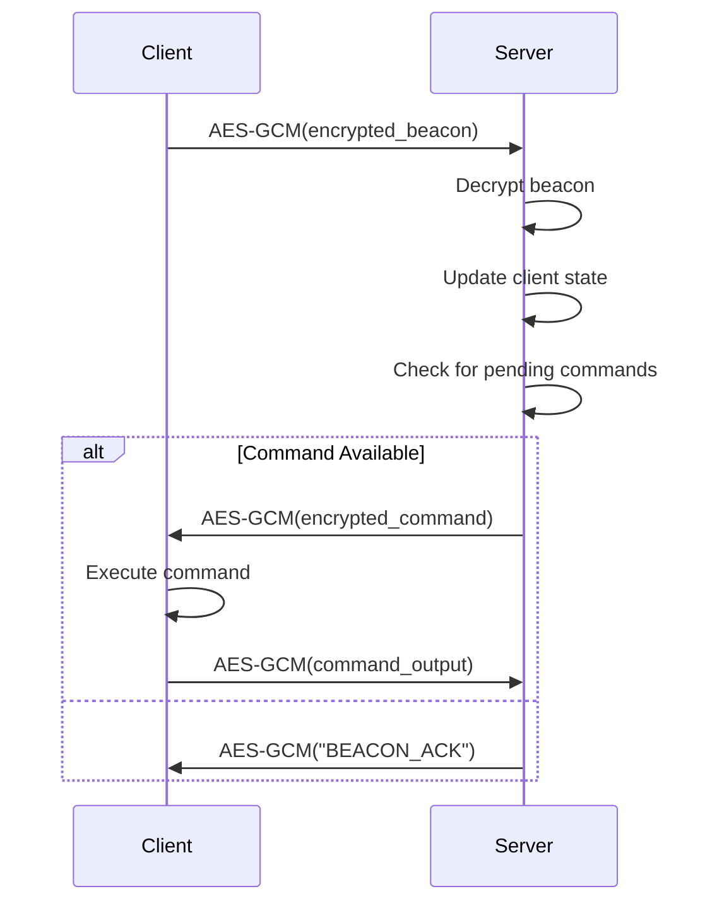
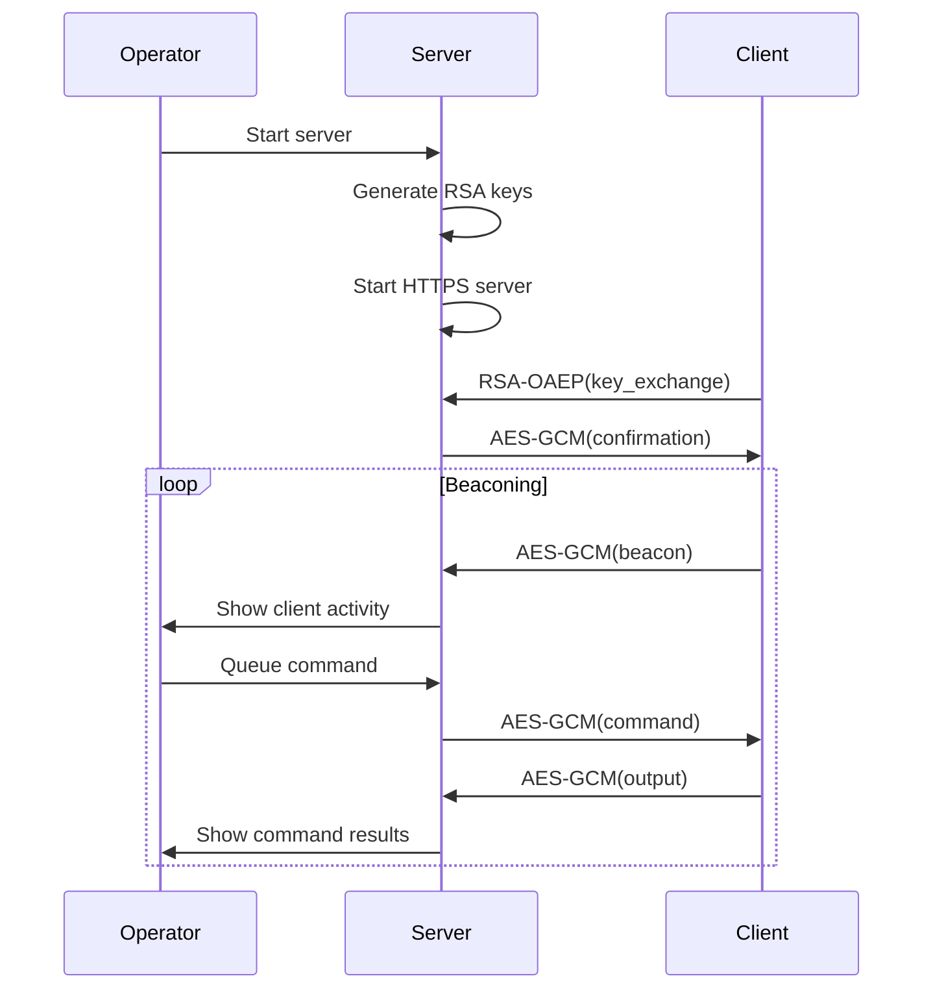

# 🖥️ STYX Server Guide

> **© 2024 Sebastian Martin. All rights reserved.**
> This documentation is proprietary and confidential. Unauthorized use, redistribution, or modification is strictly prohibited.

## 📋 Overview

The Python server (`c2_server_advanced.py`) is a sophisticated Command & Control (C2) server that manages client communications, implements advanced cryptography, and provides an operator interface for red team operations.

## 🏗️ Architecture

### Core Components

```
+------------------------+
|   HTTP/HTTPS Server    |  ← TLS 1.2+ with modern ciphers
+------------------------+
|   Cryptography Engine  |  ← RSA-OAEP, AES-256-GCM, PKCS#8
+------------------------+
|   Session Management   |  ← Thread-safe client state tracking
+------------------------+
|   Command Queueing     |  ← Prioritized command execution
+------------------------+
|   Logging & Auditing   |  ← Comprehensive operational logging
+------------------------+
|   Management Interface |  ← Interactive operator console
+------------------------+
```

### Server Layout



## 🔒 Cryptography Implementation

### RSA Key Management

**Key Generation:**
```python
def generate_rsa_keypair():
    private_key = rsa.generate_private_key(
        public_exponent=65537,
        key_size=2048,
        backend=default_backend()
    )
    return private_key, private_key.public_key()
```

**Key Serialization:**
- PKCS#8 format for private keys
- DER/PKCS1 format for public keys
- SHA-256 fingerprint generation
- Automatic C++ header generation

### RSA-OAEP Encryption/Decryption

**Client Key Exchange:**
```python
def rsa_decrypt(encrypted_data, private_key):
    return private_key.decrypt(
        encrypted_data,
        asym_padding.OAEP(
            mgf=asym_padding.MGF1(algorithm=hashes.SHA256()),
            algorithm=hashes.SHA256(),
            label=None
        )
    )
```

### AES-256-GCM Implementation

**Session Encryption:**
```python
def aes_gcm_encrypt(plaintext, key, iv):
    cipher = Cipher(algorithms.AES(key), modes.GCM(iv), backend=default_backend())
    encryptor = cipher.encryptor()
    ciphertext = encryptor.update(plaintext) + encryptor.finalize()
    return ciphertext, encryptor.tag
```

**Payload Format:**
```
[12-byte IV][16-byte TAG][N-byte ciphertext]
```

## 🌐 HTTP Server Configuration

### SSL/TLS Setup

**Modern Cipher Suite:**
```python
def setup_ssl_context():
    context = ssl.SSLContext(ssl.PROTOCOL_TLS_SERVER)
    context.load_cert_chain(SSL_CERT_FILE, SSL_KEY_FILE)
    
    # Modern cipher suites only
    context.set_ciphers(
        'ECDHE+AESGCM:ECDHE+CHACHA20:DHE+AESGCM:DHE+CHACHA20:'
        'ECDH+AESGCM:ECDH+CHACHA20:DH+AESGCM:DH+CHACHA20:'
        '!aNULL:!eNULL:!EXPORT:!DES:!RC4:!MD5:!PSK:!SRP:!CAMELLIA'
    )
    
    # Disable insecure protocols
    context.options |= ssl.OP_NO_SSLv2 | ssl.OP_NO_SSLv3 
    context.options |= ssl.OP_NO_TLSv1 | ssl.OP_NO_TLSv1_1
    
    return context
```

### HTTP Request Handling

**C2RequestHandler Class:**
```python
class C2RequestHandler(BaseHTTPRequestHandler):
    def do_POST(self):
        # Handles both key exchange and beacon requests
        if self.path == "/key_exchange":
            self._handle_key_exchange(post_data)
        elif self.path == C2_PATH:
            self._handle_c2_request(post_data)
```

## 🔄 Session Management

### Thread-Safe Client Tracking

**Global State Management:**
```python
active_clients = {}
client_keys = {}
client_state_lock = threading.Lock()

# Thread-safe access example
with client_state_lock:
    client_keys[client_ip] = decrypted_key
    active_clients[client_id] = client_data
```

### Client State Structure

**Client Information:**
```python
client_data = {
    'first_seen': datetime.now(),
    'last_seen': datetime.now(),
    'beacon_count': 1,
    'pending_commands': ['exec whoami', 'screenshot']
}
```

## 📊 Beacon Processing

### Beacon Format Parsing

**Beacon Data Structure:**
```python
def parse_beacon_data(beacon_str):
    parts = beacon_str.split('|')
    if parts[0] == 'BEACON':
        return {
            'type': 'beacon',
            'username': parts[1],
            'hostname': parts[2],
            'pid': parts[3],
            'timestamp': datetime.now().isoformat()
        }
```

### Command Processing Flow



## 🎮 Management Interface

### Interactive Console

**Operator Interface:**
```python
def management_interface():
    while True:
        print("\n=== C2 SERVER MANAGEMENT ===")
        print("1. List active clients")
        print("2. Send command to client")
        print("3. View server logs")
        print("4. Exit")
        
        choice = input("Select option: ").strip()
```

### Command Queueing

**Thread-Safe Command Management:**
```python
with client_state_lock:
    if client_id in active_clients:
        active_clients[client_id]['pending_commands'].append(command)
        print(f"Command queued for {client_id}")
```

## 📝 Logging System

### Comprehensive Logging

**Log Configuration:**
```python
logging.basicConfig(
    level=logging.DEBUG,
    format='%(asctime)s - %(name)s - %(levelname)s - %(message)s',
    handlers=[
        logging.FileHandler('c2_server.log'),
        logging.StreamHandler(sys.stdout)
    ]
)
```

### Log Events Captured

- Key exchange operations
- Beacon reception and processing
- Command execution results
- Error conditions and exceptions
- Management interface actions

## 🔧 Key Management

### RSA Key Generation

**Automatic Key Setup:**
```python
def generate_and_export_rsa_keys():
    # Try to load existing private key
    if not load_rsa_private_key():
        # Generate new keypair if none exists
        rsa_private_key, rsa_public_key = generate_rsa_keypair()
        save_rsa_private_key()
    
    # Export public key for client
    public_key_der = rsa_public_key.public_bytes(
        encoding=serialization.Encoding.DER,
        format=serialization.PublicFormat.PKCS1
    )
    
    # Generate C++ header
    generate_cpp_header(public_key_der, key_hash)
```

### C++ Header Generation

**Automatic Client Configuration:**
```python
def generate_cpp_header(public_key_der, key_hash):
    # Creates server_public_key.h with:
    # - Public key as byte array
    # - SHA-256 fingerprint
    # - Timestamp and metadata
```

## ⚙️ Configuration

### Server Configuration

**Global Settings:**
```python
C2_PORT = 8443
C2_HOST = "0.0.0.0"
C2_PATH = "/api/report"
SSL_CERT_FILE = "server.crt"
SSL_KEY_FILE = "server.key"

# Cryptography constants
RSA_KEY_SIZE = 2048
AES_KEY_SIZE = 32    # 256-bit
AES_IV_SIZE = 12     # 96-bit
AES_TAG_SIZE = 16    # 128-bit
```

### Crypto Configuration

**Algorithm Specifications:**
- RSA: 2048-bit with OAEP padding
- AES: 256-bit in GCM mode
- Hash: SHA-256 for all operations
- Key derivation: Cryptographically secure random

## 🚀 Performance Characteristics

### Server Capacity

**Resource Usage:**
- Memory per client: ~1 MB
- Concurrent clients: 50+ (hardware dependent)
- Request throughput: ~100 requests/second
- SSL handshake: ~50ms per client

### Cryptographic Performance

**Operation Timings:**
- RSA decryption: ~10ms per key exchange
- AES-GCM encryption: <1ms per request
- Session key generation: ~5ms
- Hash computation: negligible

## 🛡️ Security Features

### Transport Security

**TLS Configuration:**
- TLS 1.2+ only
- Perfect forward secrecy
- Modern cipher suites
- Certificate validation
- Hostname verification

### Data Security

**Encryption Standards:**
- End-to-end encryption
- Authenticated encryption (AES-GCM)
- Session-based keys
- Perfect forward secrecy

### Operational Security

**Security Measures:**
- Thread-safe state management
- Secure memory handling
- Comprehensive logging
- Input validation
- Error handling without information leakage

## 🔄 Operational Flow

### Server Startup Sequence

1. **Initialization**
   - Load or generate RSA keys
   - Setup SSL context
   - Initialize logging

2. **Server Startup**
   - Bind to configured host/port
   - Load SSL certificate
   - Start HTTPS server

3. **Management Interface**
   - Launch interactive console
   - Ready for client connections

### Client Connection Flow



## 🧪 Testing & Validation

### Test Environment

**Recommended Setup:**
- Isolated network
- Virtual machines
- Test certificates
- Monitoring tools

### Validation Checklist

- [ ] RSA key generation and export
- [ ] SSL context setup
- [ ] HTTPS server startup
- [ ] Key exchange processing
- [ ] Beacon handling
- [ ] Command queueing
- [ ] Management interface
- [ ] Logging functionality

### Debug Features

**Development Aids:**
- Extensive debug logging
- Error handling with context
- Performance monitoring
- State inspection utilities

## 📊 Monitoring & Maintenance

### Log Analysis

**Key Log Events:**
- Client connections and disconnections
- Command execution results
- Cryptographic operations
- Error conditions

### Performance Monitoring

**Metrics to Track:**
- Client connection count
- Request processing time
- Memory usage
- CPU utilization

### Maintenance Operations

**Regular Tasks:**
- Log rotation and archiving
- Key rotation (recommended periodic)
- Certificate renewal
- Software updates

## 🔧 API Reference

### Core Functions

#### `generate_rsa_keypair()`
```python
def generate_rsa_keypair():
    """Generates 2048-bit RSA keypair"""
```

#### `rsa_decrypt(encrypted_data, private_key)`
```python
def rsa_decrypt(encrypted_data, private_key):
    """Decrypts RSA-OAEP encrypted data"""
```

#### `aes_gcm_encrypt(plaintext, key, iv)`
```python
def aes_gcm_encrypt(plaintext, key, iv):
    """Encrypts data with AES-256-GCM"""
```

### Management Functions

#### `management_interface()`
```python
def management_interface():
    """Interactive operator console"""
```

#### `generate_and_export_rsa_keys()`
```python
def generate_and_export_rsa_keys():
    """Manages RSA key lifecycle"""
```

## 🎯 Operational Considerations

### Deployment Scenarios

**Use Cases:**
- Red team exercises
- Penetration testing
- Security training
- Research and development

### Scaling Considerations

**Performance Optimization:**
- Load balancing for multiple servers
- Database backend for client state
- Distributed logging
- High availability setup

### Security Hardening

**Production Recommendations:**
- Firewall configuration
- Intrusion detection systems
- Regular security audits
- Backup and recovery procedures

---

*This server implements enterprise-grade security features for authorized testing environments. Always ensure proper network isolation and legal compliance.*